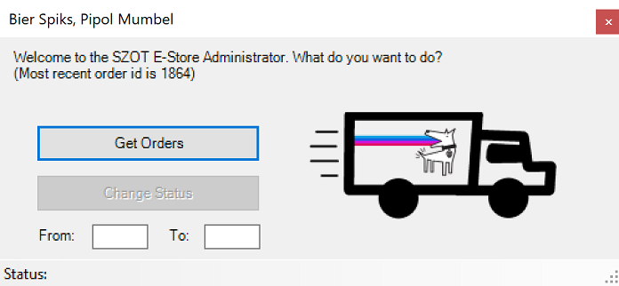

# Jumpseller-eStore-Administration

Powershell script, bat file for execution, and parameters (dummies) in txt.

Basically just set up a user interface which interacts with the Jumpseller API https://jumpseller.com/support/api/ to make life easier for my parents.
They run a family owned Brewpub/Brewery in Talagante, close to Santiago de Chile, and use the Jumpseller platform as an eStore.

store https://szot-brewpub.jumpseller.com/ ig https://www.instagram.com/cervezaszot/

It's a good platform but is missing some native functionality, though easily built hanging off of their API. 

SZOTeStoreAdmin.bat is used to change directory and run the powershell script AdminGUI.ps1 while hiding the console.  
AdminGUI.ps1 opens up a UI: 
  "Get Orders" button gets all new orders, overwriting NewOrders.html with formatted info. 
  "Change Status" button updates orders in range to "Delivered". 
  Status bar gives info while running processes and when concluded.

All resources are in the SZOT JumpSeller folder:

The choice of these languages was such that my dad wouldn't have to worry installing anything new on his PCs (sorry Python), plus I was 12000kms away and 6hrs ahead at the moment and didn't want to do much tech support by phone lol.
JS wasn't a great option either due to the browser not allowing put requests to the JumpSeller API... was just easier in powershell.

Future considerations are interacting directly with the Thermal Receipt printers already in use for the restaurant.
